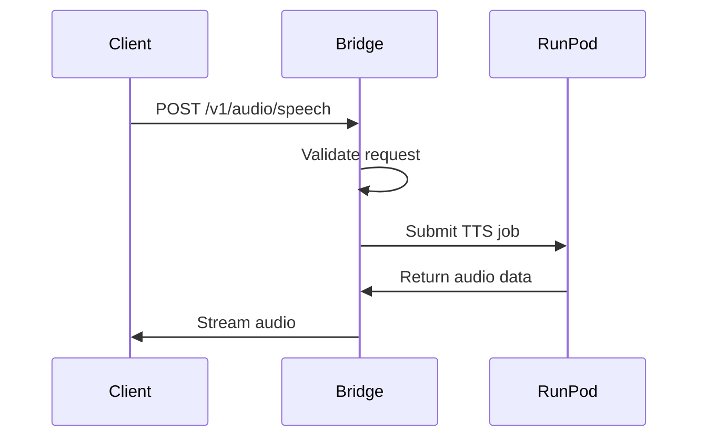

# Echo-TTS OpenAI Bridge

[](https://python.org)
[](https://fastapi.tiangolo.com)
[](LICENSE)

> A high-performance FastAPI bridge that provides OpenAI-compatible TTS endpoints by forwarding requests to RunPod serverless Echo-TTS workers.

This lightweight bridge enables seamless integration with any OpenAI TTS-compatible client while leveraging the cost-efficiency and scalability of RunPod's serverless GPU infrastructure. It forwards requests to RunPod, handles voice mapping/auth/concurrency, and streams audio back to deliver low-latency text-to-speech capabilities.

## ✨ Features

- **🔄 OpenAI Compatible**: Drop-in replacement for OpenAI's `/v1/audio/speech` endpoint
- **☁️ Serverless Architecture**: Offloads GPU processing to RunPod workers for efficient scaling
- **📝 Upstream Text Chunking**: Text chunking is handled by the RunPod worker endpoint (bridge forwards input as-is)
- **🎵 Flexible Voice Mapping**: Map OpenAI voices to custom Echo-TTS speaker files
- **🌊 Streaming Response**: Returns audio as a stream for OpenAI client compatibility
- **🔒 Optional Authentication**: Secure the bridge with bearer token authentication
- **📊 Concurrency Control**: Built-in rate limiting to prevent overloading RunPod endpoints
- **🐳 Docker Ready**: Containerized deployment with Docker Compose support

## 🏗️ Architecture


The Echo-TTS Bridge follows a streamlined architecture designed for high performance and reliability:

1. **Client Layer**: Any OpenAI TTS-compatible client sends requests to the bridge
2. **Bridge Layer**: FastAPI service validates requests and forwards them to RunPod
3. **Processing Layer**: RunPod serverless workers handle TTS generation (including text chunking if needed)
4. **Response Layer**: Audio is returned to the client

## 📊 Data Flow




## 🚀 Quick Start

### Prerequisites

- [Docker](https://docker.com) & [Docker Compose](https://docs.docker.com/compose/)
- A [RunPod](https://runpod.io) account with Echo-TTS serverless endpoint
- (Optional) Nginx Proxy Manager for SSL termination

### Installation

1. **Clone the repository**
   ```bash
   git clone https://github.com/yourusername/echoTTS-OpenAI.git
   cd echoTTS-OpenAI
   ```

2. **Configure environment**
   ```bash
   cp .env.example .env
   # Edit .env with your RunPod credentials
   ```

3. **Set up voice mapping** (optional)
   ```bash
   # Edit voice_map.json to map OpenAI voices to Echo-TTS files
   cp voice_map.json.example voice_map.json
   ```

4. **Create Docker network** (if using Nginx Proxy Manager)
   ```bash
   docker network create shared_net
   ```

5. **Build and run**
   ```bash
   docker compose build --no-cache
   docker compose up -d
   ```

### Basic Usage

```bash
# Test the endpoint
curl -X POST http://localhost:8000/v1/audio/speech \
  -H "Content-Type: application/json" \
  -d '{
    "model": "tts-1",
    "input": "Hello, this is Echo-TTS speaking!",
    "voice": "alloy"
  }' \
  --output speech.mp3
```

```python
# Python example using OpenAI client
from openai import OpenAI

client = OpenAI(
    api_key="your-key",
    base_url="https://your-domain.com/v1"
)

response = client.audio.speech.create(
    model="tts-1",
    voice="alloy",
    input="The future of AI is here!"
)

response.stream_to_file("output.mp3")
```

## 📖 Documentation

### API Reference

#### POST /v1/audio/speech

Generate speech from text using the specified voice.

**Request Body:**
```json
{
  "model": "tts-1",
  "input": "Text to convert to speech",
  "voice": "alloy",
  "response_format": "mp3",
  "speed": 1.0
}
```

**Parameters:**
- `model` (string): Must be "tts-1" for OpenAI compatibility
- `input` (string): Text to convert (max 4096 characters)
- `voice` (string): Voice to use (alloy, echo, fable, onyx, nova, shimmer)
- `response_format` (string): Audio format (mp3, opus, aac, flac, wav)
- `speed` (float): Playback speed (0.25 to 4.0)

**Response:** Binary audio data in the specified format

#### GET /health

Health check endpoint.

**Response:**
```json
{
  "status": "ok"
}
```

### Configuration

| Variable | Description | Default |
|----------|-------------|---------|
| `RUNPOD_ENDPOINT` | RunPod serverless endpoint URL | Required |
| `RUNPOD_API_KEY` | RunPod API key | Required |
| `MAX_CONCURRENT_REQUESTS` | Simultaneous RunPod requests | 3 |
| `REQUIRE_AUTH` | Enable bearer token auth | False |
| `BRIDGE_TOKEN` | Authentication token | None |
| `LOG_LEVEL` | Logging verbosity | INFO |

### Voice Mapping

Configure which Echo-TTS voice files to use for each OpenAI voice:

**Option 1: JSON File (Recommended)**
```json
{
  "alloy": "EARS_p004_freeform.mp3",
  "echo": "EARS_p005.mp3",
  "fable": "EARS_p004_freeform.mp3",
  "onyx": "EARS_p005.mp3",
  "nova": "EARS_p004_freeform.mp3",
  "shimmer": "EARS_p005.mp3"
}
```

**Option 2: Environment Variable**
```env
VOICE_MAP="alloy:EARS_p004_freeform.mp3,echo:EARS_p005.mp3"
```

## 🧪 Testing

```bash
# Run all tests
python -m pytest tests/

# Run with coverage
python -m pytest --cov=app tests/

# Run specific test
python -m pytest tests/
```

## 🐳 Docker Deployment

### Production Deployment

1. **Set up reverse proxy** (Nginx Proxy Manager example)
   - Domain: `tts.yourdomain.com`
   - Forward to: `echotts-openai:8000`
   - Enable SSL

2. **Environment variables for production**
   ```env
   REQUIRE_AUTH=True
   BRIDGE_TOKEN=your-secure-token
   LOG_LEVEL=WARNING
   MAX_CONCURRENT_REQUESTS=5
   ```

3. **Deploy**
   ```bash
   docker compose -f docker-compose.yml -f docker-compose.prod.yml up -d
   ```

### Health Monitoring

```bash
# Check container status
docker compose ps

# View logs
docker compose logs -f echotts-openai

# Health check
curl http://localhost:8000/health
```

## 🔧 Development

### Local Development

```bash
# Setup virtual environment
python3 -m venv venv
source venv/bin/activate  # Linux/Mac
pip install -r requirements.txt

# Set environment variables
export RUNPOD_ENDPOINT=your_endpoint
export RUNPOD_API_KEY=your_key

# Run development server
uvicorn app.main:app --reload --host 0.0.0.0 --port 8000
```

### Code Structure

```
app/
├── main.py              # FastAPI application and endpoints
├── config.py            # Configuration management
├── audio_processor.py   # RunPod client and audio handling
└── models/
    ├── __init__.py
    └── schemas.py       # Pydantic models
```

### Adding New Voices

1. Add your voice file to the RunPod worker
2. Update `voice_map.json`:
   ```json
   {
     "custom_voice": "your_voice_file.mp3"
   }
   ```
3. Restart the service

## 🤝 Contributing

Contributions are welcome! Please feel free to submit a Pull Request.

1. Fork the repository
2. Create your feature branch (`git checkout -b feature/amazing-feature`)
3. Commit your changes (`git commit -m 'Add some amazing feature'`)
4. Push to the branch (`git push origin feature/amazing-feature`)
5. Open a Pull Request

### Development Guidelines

- Follow PEP 8 for Python code style
- Add tests for new features
- Update documentation as needed
- Keep PRs focused and atomic

## 📄 License

This project is licensed under the MIT License - see the [LICENSE](LICENSE) file for details.

## 🙏 Acknowledgments

- [OpenAI](https://openai.com) for the TTS API specification
- [RunPod](https://runpod.io) for serverless GPU infrastructure
- [FastAPI](https://fastapi.tiangolo.com) for the web framework
- [Echo-TTS](https://github.com) for the underlying TTS model

## 📞 Support

- 🐛 Report bugs: [GitHub Issues](https://github.com/yourusername/echoTTS-OpenAI/issues)
- 💬 Discussions: [GitHub Discussions](https://github.com/yourusername/echoTTS-OpenAI/discussions)
- 📧 Email: support@yourdomain.com
